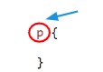
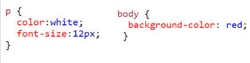

# Code Clips 🆘

## Copy any of the code you need from below.

## CSS

 ### How to use css
  Insert the selector tag you want to style. For example, **p, h1, ol, ul, body etc**

 

 Then in between the ** { }** curly brackets include the property you would like to change. 


   ### CSS properties
  #### Width  - (larger number larger the width)
  
  ```css:
width: 10px;
```
 #### Height  - (larger number larger the height)
 ```css:
height: 20px;
```

 #### Text colour - [hex colours](http://bit.ly/cssfonts)
 ```css:
color: white;
```

 #### Background colour - [hex colours](http://bit.ly/cssfonts)
 ```css:
background-color: red;
```
 #### Gradient[ background colours](http://bit.ly/cssGradient)
 ```css:
 background-image: linear-gradient(red, yellow);
 ```

 #### Font family - [different fonts available](http://bit.ly/cssfonts)
 ```css:
font-family: Comic Sans MS;
```

 #### Font size - (larger number larger font size)
 ```css:
font-size: 12px;
```

 #### Text align - (center, right, left)
 ```css:
text-align: center;
```

